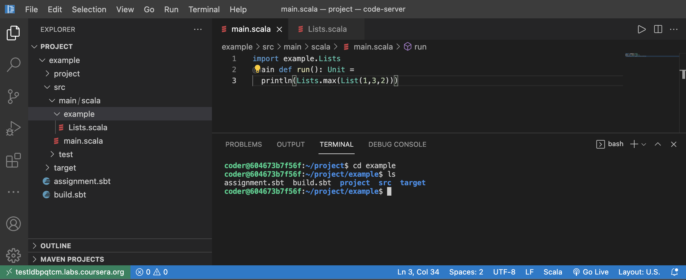
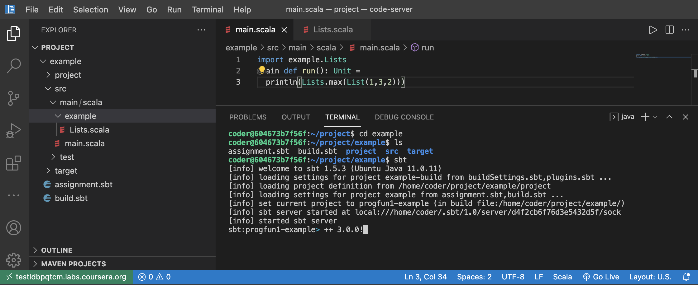
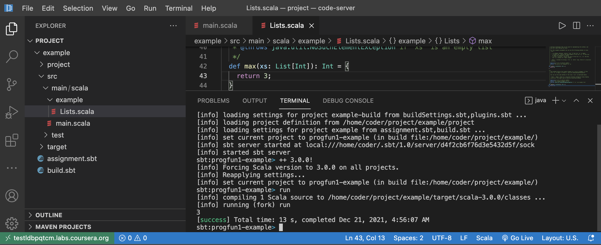

# Getting Started with your Lab Sandbox
VSCode Sandbox comes with Java, CPP, C,C#, Python, Node JS, Scala, Ruby, PHP and Go preinstalled. All basic packages including the I/O package, data structures, Math package etc., are available for all the languages.

## What extensions are already installed in this environment?
There are many extensions that come preinstalled which include compiler, runner, debugger, unit tester etc., You can click on the extensions icon on the left panel of VSCode to see what extensions come with the sandbox instance. **Metals** extension has been preinstalled. The extension activates when the main directory contains build.sbt or build.sc file, a Scala file is opened, which includes *.sbt, *.scala and *.sc file, or a standard Scala directory structure src/main/scala is detected.

## How can I compile the Code in my Terminal?
Open the terminal and navigate to the directory containing your file. 
```sh
cd /home/coder/project/<directory>
```
- Use `scalac <filename>` to compile the scala code for scala version 2. For example, if your code is HelloWorld.scala, run the following command to compile.

```sh
scalac HelloWorld.scala
```
This will produce an output HelloWorld.class which is executable. 

- Use `scala3-compiler <filename>` to compile the scala code for scala version 2. For example, if your code is HelloWorld.scala, run the following command to compile.

```sh
scala3-compiler HelloWorld.scala
```

This will produce an output HelloWorld.class which is executable. 


To run the class with scala2, run the following command.

```sh
scala HelloWorld
```

To run the class with scala3, run the following command.

```sh
scala3 HelloWorld
```

## Known Issues in sample code and fixes
- The scala version used in the code sample is version 3. To compile and run ensure you use scala3-compiler and scala3 as shown about. To run it through sbt, make sure you are in the directory which contains the build.sbt. 



- Run `sbt` to enter into the sbt prompt. This will load all the required libraries.


- Inside the sbt prompt, enter `++ 3.0.0!` to ensure that sbt runs with version 3 of scala.




- Type `run` press enter for it to compile the classes and run the main class. Please refer to the main.scala in the practice lab. 

```scala
import example.Lists
@main def run(): Unit =
  println(Lists.max(List(1,3,2)))
```

- All the dependent classes are automatically compiled and build when you invoke `run`.




## Assignment specific Instructions

Some assignments may have User Interfaces (UI) that are Web-based, i.e., they run in an HTML page in your Web browser. 

You can use the steps below to view these applications:

1. Open the HTML page with live server by right clicking the file and clicking on `Open with Live Server` option. 

2. In the left panel, click on **Browser Preview**

3. In the browser that opens, type `localhost:5500/<path to the file>` 

## How can I Debug the code?
You can set break points by clicking to the left of line number where you want to break and investigate.
You can use the debugger in VSCode IDE using the icon on the left panel.